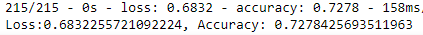
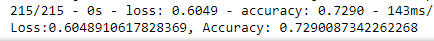
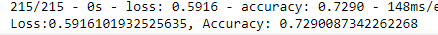

# Neural_Network_Charity_Analysis

# Overview
With our knowledge of machine learning and neural networks, we used the features in the provided dataset to help our client, Beks, create a binary classifier that is capable of predicting whether applicants will be successful if funded by Alphabet Soup.

## Results

### Data Processing
* The variables we decided to consider for this model are 'STATUS', 'ASK_AMT', 'IS_SUCCESSFUL', 'APPLICATION_TYPE', 'CLASSIFICATION', 'USE_CASE', 'ORGANIZATION',  'INCOME_AMT'. I dropped "USE_CASE_Other","AFFILIATION_Other" columns.
* The EIN and the NAME variables were removed 
* Our target is to predict the "Is_SUCCESSFUL" to the highes accuracy

### Compiling, Training, and Evaluating the Model

Attempt #1
* Our neural network consisted of 80 neurons in Layer 1 and 30 in Layer 2, and 2 Hidden Layers. 
* A Relu amd and Sigmoid Activations Functions were used because sigmoids work well with binary problems and relu is used with nonlinear datasets
* To increase model performance the "USE_CASE_Other" and "AFFILIATION_Other" columns were removed from the dataset

Attempt #2

* Our neural network consisted of 80 neurons in Layer 1, 30 in Layer 2, and 15 in Layer 3, and 3 Hidden Layers, 
* A Relu amd and Sigmoid Activations Functions were used because sigmoids work well with binary problems and relu is used with nonlinear datasets
* To increase model performance the "USE_CASE_Other" and "AFFILIATION_Other" columns were removed from the dataset

Attempt #3

* Our neural network consisted of 80 neurons in Layer 1, 35 in Layer 2, and 10 in Layer 3, and 3 Hidden Layers, 
* A Relu amd and Sigmoid Activations Functions were used because sigmoids work well with binary problems and relu is used with nonlinear datasets
* Used original data for best performance

### Summary

As shown in the images above, all the models maintained an accuracy of ~73%. To increase performance A Random Forest classifier may be used in the future due to the fact that Random Forest has an very in depth analysis and large number of estimators. Random Forest models also experience faster performance than normal neural networks and could reduce any errors from overfitting. 
